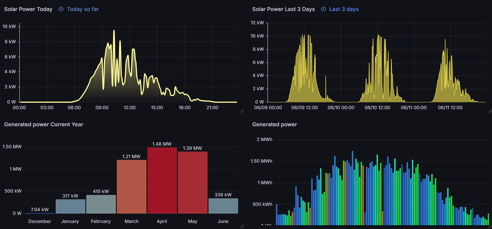

# sbfspot_sunnypower

<!-- TOC tocDepth:2..3 chapterDepth:2..6 -->

- [1. Prerequisites](#1-prerequisites)
- [2. Installation & Usage](#2-installation-usage)
- [3. Configuration Parameters](#3-configuration-parameters)
- [4. How it Works](#4-how-it-works)

<!-- /TOC -->

## Project 

A lightweight Docker container designed to periodically push historical solar production data from an SMA Sunny Tripower inverter (via sbfspot) into an InfluxDB v3 database. 

By default, this sync runs hourly, ensuring your dashboards and monitoring tools always have up-to-date yield and phase data.

Which SMA device do I use: Sunny Tripower solar inverter <br>
Probably any device consultable via Sunny Explorer or sbfspot should work.

This is the endresult in Grafana & how I load them into homeassistant.



## 1. Prerequisites

* A running instance of the [sbfspot](https://github.com/nakla/sbfspot) container generating a SQLite database (`sbfspot.db`).
* An InfluxDB v3 instance ready to accept connections.

## 2. Installation & Usage

Add the following service definition to your `docker-compose.yml` file:

```yaml
  sbfspot_sp:
    image: ghcr.io/trueosiris/sbfspot_sunnypower:latest
    restart: unless-stopped
    volumes:
      - ./sbfspot/data:/data:rw
    environment:
      - TZ=Europe/Brussels
      - CRON_SCHEDULE=0 * * * * # Optional: Change this to alter the frequency (e.g., "*/30 * * * *" for every 30 mins)
      - SQLITE_DB=/data/sbfspot.db
      - INFLUX_URL=http://10.10.0.6:8181
      - INFLUX_TOKEN=apiv3_your_token_here # MANDATORY: Generate this in InfluxDB v3
      - INFLUX_ORG=defaultorg
      - INFLUX_DATABASE=solarpanels
```

**⚠️ Important:** `INFLUX_TOKEN` is **mandatory** and must be set. Generate a new API token in your InfluxDB instance.

Although we set write access on the .db file, the Python script opens the .db as read only.<br>
When it was set to read-only on the docker volume, this was the exception: "An error occurred: unable to open database file".<br>

### One-off maintenance runs

If you want to trigger a single import from the host without starting the container's normal cron loop, override the entrypoint and call the script directly:

```bash
python3 /app/src/backfill_history_to_influxdb.py --full-reimport
```

The equivalent host-side Docker Compose commands are:

```bash
docker compose run --rm --entrypoint python3 sbfspot_sp /app/src/backfill_history_to_influxdb.py --full-reimport
```

`INFLUX_DATABASE` is the InfluxDB v3 database name. `--full-reimport` imports all rows from SQLite without filtering. No cleanup/delete is performed by this script.

## 3. Configuration Parameters

The container's behavior is fully controlled via environment variables:

* `TZ`: Timezone for the cron daemon (Default: `Europe/Brussels`).
* `CRON_SCHEDULE`: The frequency of the data sync using standard cron syntax (Default: `0 * * * *` for hourly).
* `SQLITE_DB`: The internal path to the mounted sbfspot database.
* `INFLUX_URL`: The full HTTP/HTTPS URL and port to your InfluxDB v3 server.
* `INFLUX_TOKEN`: **[MANDATORY]** Your InfluxDB v3 API authentication token (must start with `apiv3_`). Generate this in your InfluxDB console.
* `INFLUX_ORG`: Your InfluxDB organization name (Default: `defaultorg`).
* `INFLUX_DATABASE`: The target InfluxDB v3 database name for the solar metrics.

## 4. How it Works

On startup, the container immediately executes the Python sync script to catch up on any missing data. It then hands off control to a background cron daemon that triggers the migration script according to your configured `CRON_SCHEDULE`. The script efficiently batches records to minimize memory usage and safely ignores data that lacks a valid timestamp.